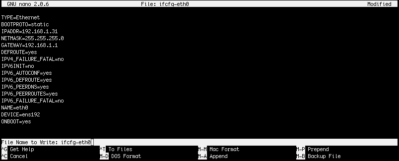

# Setting up network configuration

Next step is to configure network connection. To do this you will need to edit network configuration file. Default configuration will try to assign IP adress from DHCP.

Use `sudo` command to run shell with root privileges:

```text
$ sudo -s
```

When ask for password use password for kodo user.

Edit network configuration file:

```text
# nano /etc/sysconfig/netork-scripts/ifcfg-eth0
```

To set up static IP adress change:

```text
BOOTPROTO=dhcp
```

to

```text
BOOTPROTO=static
```

Next uncomment \(delete the `#` character\) following options:

* IPADDR=YOUR\_IP\_ADDRESS
* NETMASK=YOUR\_NETMASK
* GATEWAY=YOUR\_GATEWAY

and change them according to your requirements.

**IPADDR** - IP address of the KODO Server  
**NETMASK** - netmask value of your network  
**GATEWAY** - gateway value of your network

Sample configuration file:

```text
TYPE=Ethernet
BOOTPROTO=static
IPADDR=192.168.1.31
NETMASK=255.255.255.0
GATEWAY=192.168.1.1
DEFROUTE=yes
IPV4_FAILURE_FATAL=no
IPV6INIT=no
IPV6_AUTOCONF=yes
IPV6_DEFROUTE=yes
IPV6_PEERDNS=yes
IPV6_PEERROUTES=yes
IPV6_FAILURE_FATAL=no
NAME=eth0
DEVICE=ens192
ONBOOT=yes
```

Save the file pressing the `CTRL+o` and then `Enter` key.



After file is saved you can exit editor pressing `CTRL+x` key combiantion.

The final step is to restar network configuration. To do this use the command:

```text
# service network restart
```

Now you shoud be able login your KODO system using webbrowser and IP address that you configured in previous steps. Open webbrowser and enter:

```text
https://ip_address
```

KODO login page shoud be opened.


