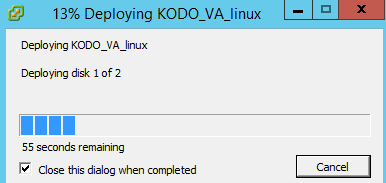

# Deploying VA

Before you will start deploying process, make sure that all requirements are met.

Once you finish the deployment you go to the next chapter that will guide you how to configure network connetion.

The KODO Server Virtual Appliance comes as an OVA \(Open Virtualization Appliance\) file. The OVA file is a template that contains a functional CentOS 7 operating system. To deploy the KODO Server OVA file, follow the instructions:

1. Connect to your vCenter Server using vSphere Client, or directly to ESXi server.
2. Click **File &gt; Deploy OVF Template**
3. Click **Browse**, and navigate to the OVA file that you downloaded and then click **Open**
4. Click Next in the OVF Template Details window.
5. Follow the instructions to complete installation and specify the following information:
   * Name and Location
   * Host/Cluster
   * Resource Pool
   * Storage
   * Disk Format
   * Network Mapping
6. Review virtual machine configuration and click Finish
7. Virtual machine deployment will start. This process will automatically create a virtual machine with the settings you specify.

   

8. When the KODO Server VA is deployed, power it on. You can now go to the next chapter and configure network connection.

